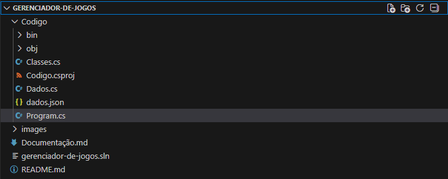

# Descrição Detalhada do Projeto

O sistema desenvolvido é uma aplicação de console em C# que simula uma plataforma de gerenciamento de jogos e conquistas, semelhante a serviços como Steam, Xbox Live ou PlayStation Network. O programa permite o cadastro de usuários, autenticação, gerenciamento de jogos pela parte administrativa e acompanhamento de conquistas por parte dos usuários comuns.

A aplicação trabalha com dois tipos de perfis:

- Administrador (Admin)
Possui permissões especiais, como registrar novos jogos e definir suas conquistas.

- Usuário
Pode montar sua biblioteca, desbloquear conquistas, acumular XP, subir de nível e comparar progresso com outros usuários.

## Funcionalidades principais:
### 1. Sistema de Login e Cadastro

- Login com validação de credenciais.
- Cadastro de novos usuários.
- Diferenciação automática entre Admin e Usuário.

### 2. Funções do Administrador

Cadastrar jogos com:

- ID automático
- Nome
- Gênero
- Lista de conquistas

Cadastrar conquistas para cada jogo, contendo:

- Nome
- XP
- Dificuldade

### 3. Funções do Usuário

- Visualizar sua biblioteca com todos os jogos e suas conquistas.
- Adicionar jogos cadastrados pelo Admin à sua biblioteca pessoal.
- Marcar conquistas como desbloqueadas.
- Ganhar XP ao desbloquear conquistas.
- Sistema automático de nível (1 nível a cada 1000 XP).
Comparar:

- Seu progresso com outro usuário.
- Seu progresso em um jogo específico com outro usuário.

### 4. Armazenamento persistente

O sistema salva todos os dados em arquivo JSON (dados.json):

- Usuários
- Admins
- Jogos cadastrados globalmente
- Bibliotecas individuais com conquistas e status

  # Arquitetura do Sistema

  A imagem a seguir mostra a organização das pastas e o nome de todos os arquivos:

  

 ##  Camada de Aplicação (Program.cs)

É responsável por:

- Carregar o banco de dados ao iniciar.
- Exibir o menu principal (login, cadastro, sair).
Controlar o fluxo entre menus:
- Menu do Admin
- Menu do Usuário

### Principais métodos:

`Main()`

- Inicia o programa
- Carrega dados
- Exibe o menu principal

`TelaPrincipalUsuario(Usuario usuario)`
- Menu com todas ações do usuário.

`TelaPrincipalAdmin()`
-Menu para cadastro e gerenciamento de jogos.

## Camada de Domínio (Classes.cs)

Inclui todas as classes principais do projeto.

### Pessoa (classe base)

Propriedades:

- id
- nome
- senha

Funções:

- Login
- Cadastro de novo usuário

### Admin (herda Pessoa)

Permissões especiais:

- Cadastrar jogo (CadastrarJogo)
- Cadastrar conquista (CadastrarConquista)
  
Admin é encontrado no banco por nome e senha, optamos por ter um admin fixo temporariamente para facilitar o acesso a área de cadastro de jogos e conquista.

### Usuario (herda Pessoa)

O usuário contém:

- Sistema de níveis (Nivel)
- Sistema de experiência (Experiencia)
- Biblioteca própria (BibliotecaUsuario)

Principais métodos:

- MostrarBiblioteca()
- AdicionarJogo()
- MarcarConquista()
- CompararUsuario()
- CompararJogoComUsuario()

### BibliotecaUsuario

Gerencia os jogos que pertencem a um usuário.

Funções:

- Buscar jogo por nome
- Buscar conquista por nome

### Jogo

Estrutura:

- id
- nome
- genero
- conquistas

### Conquista

Estrutura:

- id
- nome
- XP
- dificuldade
- status (Bloqueada / Desbloqueada)

## Camada de Dados (Dados.cs)

Controla:

- Salvamento e carregamento dos dados
- Estrutura do armazenamento em BancoDeDados

Componentes principais:

### BancoDeDados

Agrupa listas de:

- admins
- usuarios
- jogos

### Database (static)

Gerencia:

- Carregar() → lê arquivo JSON
- Salvar() → grava no arquivo
